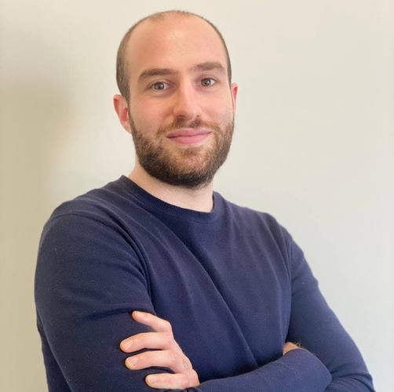
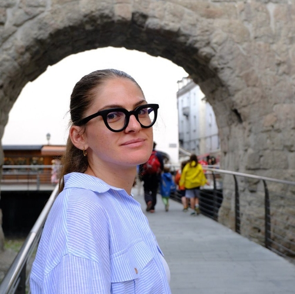
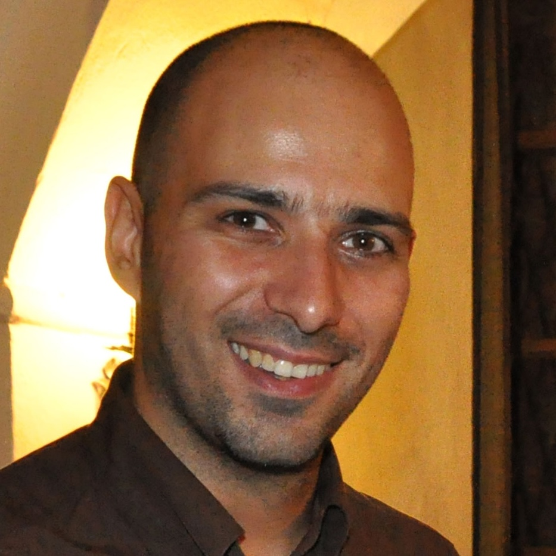

## Organizing Committee ##

<table>
    <col width="20%" />
    <col width="20%" />
    <col width="20%" />
    <tr>
        <td></td>
        <td></td>
        <td></td>
    </tr>
    <tr>
        <td> 
            <a href='https://www.tudelft.nl/en/eemcs/the-faculty/departments/intelligent-systems/cybersecurityeemcs/people/andrea-agiollo'>Andrea Agiollo</a>
            <a href='mailto:A.Agiollo-1@tudelft.nl'>📧</a>
            <b>(Primary contact)</b>
        </td>
        <td> 
            <a href='https://bardhienkeleda.github.io'>Enkeleda Bardhi</a>
            <a href='mailto:E.Bardhi-1@tudelft.nl'>📧</a>
            <b>(Primary contact)</b>
        </td>
        <td> 
            <a href='https://sites.google.com/diag.uniroma1.it/lazzerettiriccardo/home?authuser=0'>Riccardo Lazzeretti</a> 
            <a href='mailto:lazzeretti@diag.uniroma1.it'>📧</a>
        </td>
    </tr>
    <tr>
        <td> TU Delft, The Netherlands </td>
        <td> TU Delft, The Netherlands </td>
        <td> Sapienza University of Rome, Italy </td>
    </tr>
 </table>

## Keynote Speaker

- TBD.

## Program Committee

- Gianluca Capozzi, Karlsruhe Institute of Technology
- Giorgia di Pietro, Sapienza University of Rome
- Alessandro Palma, Sapienza University of Rome

TBC.

